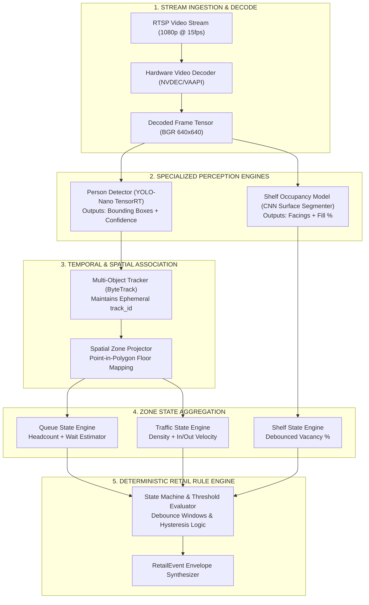

# docs/ai/ai-architecture.md — Artificial Intelligence Architecture Specification

> **DECOUPLED, MODULAR COMPUTER VISION & RULE EVALUATION**
> 
> This document specifies the modular AI architecture of Retail Intelligencia. The system avoids monolithic "black box" models in favor of specialized, decoupled vision stages orchestrated by a deterministic retail rule engine.

---

## 1. The Modular Architecture Philosophy

In enterprise edge computer vision, attempting to solve all operational problems with a single massive model (or an unconstrained generative Multimodal Large Language Model) results in:
* Prohibitive GPU memory requirements on edge hardware.
* Non-deterministic outputs, hallucinations, and erratic threshold behaviors.
* Inability to independently calibrate, benchmark, or replace individual models.

Retail Intelligencia enforces a **decoupled, multi-stage pipeline**:

---

## 2. Prohibition of Generative LLMs for MVP Vision Logic

> **CRITICAL ARCHITECTURAL CONSTRAINT**
> 
> Generative Large Language Models (LLMs) or Vision-Language Models (VLMs) must **NOT** be used for:
> * Frame-by-frame person detection
> * Queue headcount calculation
> * Shelf occupancy percentage estimation
> * Dwell time tracking
> * Event envelope generation

### Rationale:
1. **Determinism**: Supermarket operations require 100% predictable, reproducible thresholds (e.g., exactly 6 people trigger a queue alert, not "around 6-ish people").
2. **Latency & Throughput**: Edge Jetson devices must process 4 to 16 video channels at 10–15 FPS. Lightweight CNNs execute in 15–25 ms; VLMs take hundreds to thousands of milliseconds per frame.
3. **Auditability**: Machine learning detections must yield verifiable geometric coordinates (bounding boxes, polygons, confidence floats), not generative narrative hallucinations.

---

## 3. Pipeline Stage Decoupling

1. **Decoupled Perception**: The person detector knows nothing about store rules, queues, or checkout registers. It simply produces bounding boxes: `[x1, y1, x2, y2, confidence, class="person"]`.
2. **Decoupled Tracking**: ByteTrack associates detections across consecutive frames to maintain smooth trajectory coordinates. It does not know the customer's identity or intent.
3. **Decoupled Spatial Mapping**: The spatial zone engine performs fast geometric point-in-polygon math, determining whether a person's foot coordinate falls within a configured zone boundary.
4. **Decoupled Business Rules**: The retail rule engine consumes aggregated zone numbers over time windows, applying deterministic retail logic to emit structured events.
