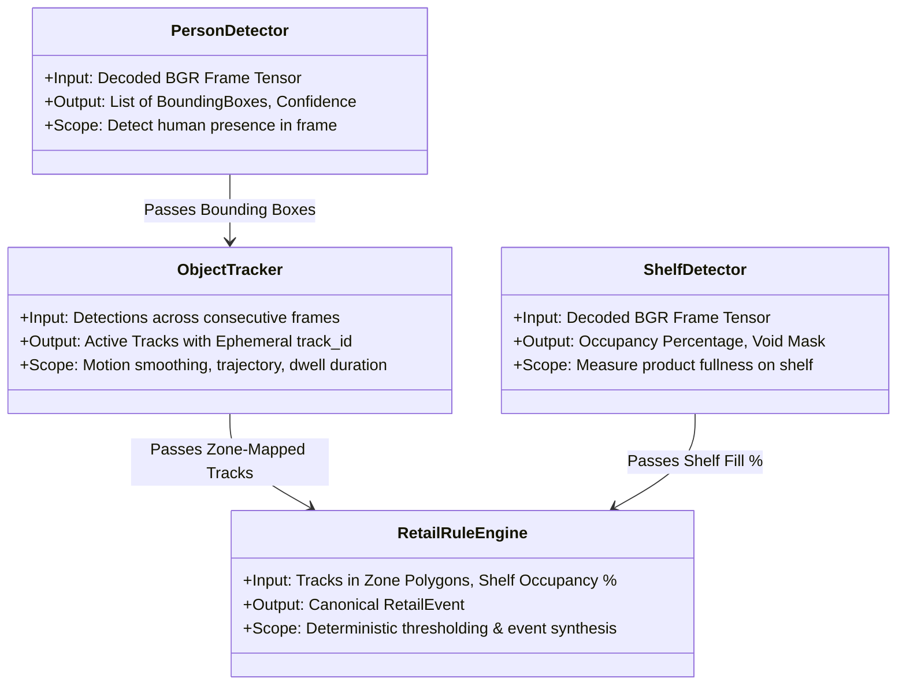

# docs/ai/model-responsibilities.md — Model Responsibilities Specification

> **FUNCTIONAL ROLES OF COMPUTER VISION & LOGIC MODULES**
> 
> This document specifies the precise inputs, outputs, operational boundaries, and failure boundaries for each artificial intelligence model and heuristic engine on the edge device.

---

## 1. Summary of Modules



---

## 2. Person Detection Module

* **Model Architecture**: Ultralytics YOLOv8-Nano / YOLOv8-Small or MobileNet-SSD optimized via NVIDIA TensorRT (FP16/INT8 precision).
* **Execution Environment**: Edge GPU / NPU hardware accelerator.
* **Input**:
  * Decoded image tensor (`640 × 640 × 3`, normalized BGR).
* **Output**:
  * Array of detection tuples:
    ```python
    [
      {
        "bbox": [x1, y1, x2, y2],  # Normalized or pixel coordinates
        "confidence": 0.88,         # Float between 0.0 and 1.0
        "class_id": 0               # 0 = person
      }
    ]
    ```
* **Operational Scope**:
  * Identifies patrons, staff members, and children in the camera field of view.
  * Used exclusively to feed the object tracker.
* **Explicit Exclusions**:
  * Does NOT perform facial landmarking, eye gaze tracking, or biometric feature extraction.
  * Does NOT perform gender, age, or ethnic demographic classification.

---

## 3. Product & Shelf Occupancy Module

* **Model Architecture**: Lightweight Convolutional Segmentation / Surface Depth Heuristic Model (e.g. YOLOv8-Seg or custom edge patch classifier).
* **Execution Environment**: Edge GPU / NPU accelerator.
* **Input**:
  * Region-of-Interest (ROI) cropped shelf compartment image tensor (`384 × 384 × 3`).
* **Output**:
  * Numerical occupancy metric:
    ```python
    {
      "shelf_id": "shelf_04_b",
      "occupancy_percentage": 14.5,  # Float: 0.0 to 100.0
      "is_empty": False,             # True if occupancy == 0.0
      "confidence": 0.93             # Model certainty in surface visibility
    }
    ```
* **Operational Scope**:
  * Evaluates physical product facings and depth fill on merchandise shelves.
  * Detects voids between products and exposed shelf backing/dividers.
* **Explicit Exclusions**:
  * Does NOT perform individual product barcode reading or price tag text extraction (handled by dedicated handheld store scanners).

---

## 4. Multi-Object Tracking (MOT) Module

* **Algorithm**: ByteTrack (High/Low confidence two-stage Kalman filter association) or SORT.
* **Execution Environment**: Edge CPU (low computational overhead, <5ms per frame).
* **Input**:
  * Frame-by-frame person bounding boxes from the Person Detector.
* **Output**:
  * Active track state vector:
    ```python
    {
      "track_id": 142,                       # Ephemeral integer ID
      "ground_point": [x_foot, y_foot],      # Bottom-center bounding box point
      "velocity": [vx, vy],                  # Estimated directional speed
      "active_duration_seconds": 38.4,       # Time tracked in current camera view
      "status": "CONFIRMED"                  # TENTATIVE, CONFIRMED, DELETED
    }
    ```
* **Operational Scope**:
  * Connects detections across frames to estimate continuous pedestrian movement.
  * Tracks entry and exit times across polygon zones to calculate exact dwell time.
* **CRITICAL PRIVACY DIRECTIVE**:
  * `track_id` is an **ephemeral in-memory integer**.
  * It exists solely while the subject remains inside that single camera's field of view.
  * When the subject walks out of view, the `track_id` is permanently deleted from memory.
  * **`track_id` IS NOT A PERSISTENT CUSTOMER IDENTIFIER AND IS NEVER SAVED TO THE CLOUD DATABASE AS A CUSTOMER IDENTITY.**

---

## 5. Deterministic Retail Rule Engine

* **Engine Type**: State machine and temporal debounce evaluator.
* **Execution Environment**: Edge CPU (Python / C++ daemon).
* **Input**:
  * Active tracks mapped to spatial polygon zones.
  * Shelf occupancy percentages mapped to shelf bays.
  * Store configuration thresholds (from MQTT `/config`).
* **Processing Logic**:
  * **Queue Evaluation**: `Count(tracks in checkout_zone) >= threshold` sustained for `duration >= 60s`.
  * **Shelf Evaluation**: `shelf_occupancy <= threshold` sustained for `duration >= 15s`.
  * **Traffic Evaluation**: `Count(zone entries) / window_minutes`.
  * **Dwell Evaluation**: `track.active_duration_seconds >= dwell_limit`.
* **Output**:
  * Synthesizes and signs the canonical `RetailEvent` JSON envelope.
  * Dispatches event to the local SQLite WAL buffer.
