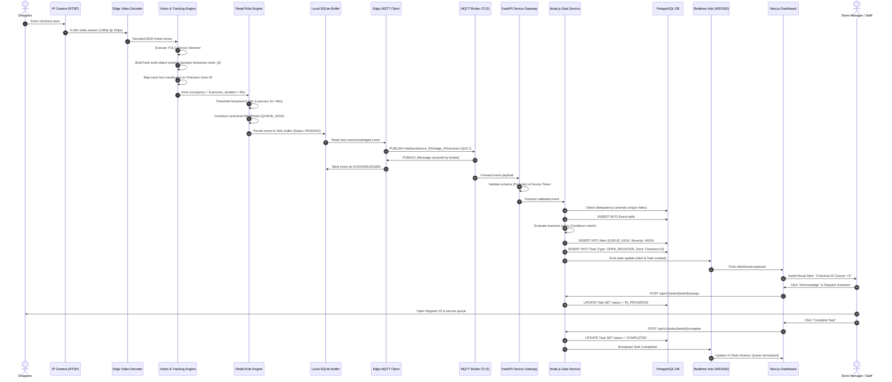

# docs/architecture/data-flow.md — End-to-End Data Flow Specification

> **THE OPERATIONAL LIFECYCLE OF AN INTELLIGENCE EVENT**
> 
> This document details the exact end-to-end data flow in Retail Intelligencia, tracing raw optical sensory input through edge inference, message transport, backend persistence, realtime dissemination, and final human remediation.

---

## 1. The Core Lifecycle: Sense, Understand, Decide, Act

The lifecycle of an operational event transitions through distinct phases with rigid data transformations at each stage:

```text
[STAGE 1: SENSE]
  Optical Sensors ──► Video Decoding ──► In-Memory Frame Buffer
         │
[STAGE 2: UNDERSTAND]
  Frame Buffer ──► TensorRT Inference ──► Bounding Boxes ──► ByteTrack MOT ──► Spatial Zone Association
         │
[STAGE 3: DECIDE]
  Zone State Aggregator ──► Deterministic Rule Engine ──► Canonical RetailEvent ──► Local SQLite Buffer
         │
[STAGE 4: COMMUNICATE]
  Buffer Drainer ──► TLS 1.3 MQTT Publisher ──► Central MQTT Broker ──► FastAPI Device Gateway
         │
[STAGE 5: PERSIST & ESCALATE]
  FastAPI Schema Validation ──► Node.js Data Service ──► PostgreSQL (Prisma) ──► Alert / Task Generation
         │
[STAGE 6: ACT]
  Realtime Hub (WebSocket/SSE) ──► Next.js Command Center ──► Staff Acknowledgment & Task Completion
```

---

## 2. End-to-End Sequence Diagram

The following sequence diagram illustrates the lifecycle of a high-priority retail event (e.g. `QUEUE_HIGH` at Checkout 02):



---

## 3. Data Transformations by Pipeline Stage

### Stage 1: Optical Frame to Detections
* **Input**: Continuous H.264/H.265 encoded NAL units over RTSP.
* **Transformation**: Hardware decompression to uncompressed BGR NumPy / TensorRT buffer (`1920x1080x3` or downsampled `640x640x3`).
* **Output**: Detections array:
  ```json
  [
    { "class": "person", "confidence": 0.89, "bbox": [420, 150, 510, 390] },
    { "class": "person", "confidence": 0.93, "bbox": [530, 160, 610, 410] }
  ]
  ```

### Stage 2: Detections to Spatial Tracks
* **Input**: Bounding boxes and frame sequence.
* **Transformation**: Kalman filter velocity projection and Hungarian matching (ByteTrack).
* **Output**: Track array:
  ```json
  [
    { "trackId": 104, "groundPoint": [465, 390], "dwellSeconds": 72.4, "zoneId": "zone_checkout_02" },
    { "trackId": 105, "groundPoint": [570, 410], "dwellSeconds": 64.1, "zoneId": "zone_checkout_02" }
  ]
  ```

### Stage 3: Spatial Tracks to `RetailEvent`
* **Input**: Aggregated zone states evaluated across time windows.
* **Transformation**: Rule evaluation against store configuration: `count(trackId in zone_checkout_02) >= 6 for > 60 seconds`.
* **Output**: Canonical `RetailEvent`:
  ```json
  {
    "eventId": "evt_01J98X7Z8K3M0W4V8R9N1P2Q3R",
    "eventVersion": "1.0",
    "eventType": "QUEUE_HIGH",
    "deviceId": "edge_001",
    "storeId": "store_001",
    "zoneId": "zone_checkout_02",
    "timestamp": "2026-09-05T10:30:00Z",
    "confidence": 0.94,
    "severity": "HIGH",
    "metadata": {
      "checkoutId": "checkout_02",
      "queueCount": 8,
      "threshold": 6,
      "estimatedWaitSeconds": 240
    },
    "source": {
      "cameraId": "cam_02",
      "modelId": "person-detector-yolov8",
      "modelVersion": "1.2.0"
    },
    "schemaVersion": "1.0"
  }
  ```

### Stage 4: `RetailEvent` to Backend Alerts & Tasks
* **Input**: Canonical `RetailEvent` delivered over MQTT.
* **Transformation**: Schema validation, deduplication, cooldown verification, and entity generation.
* **Output**:
  * Persisted `Event` record in PostgreSQL.
  * Persisted `Alert` record (e.g. `alert_01J98...`, status: `ACTIVE`).
  * Persisted `Task` record (e.g. `task_01J98...`, title: "Open Additional Register at Checkout 02", status: `PENDING`).

---

## 4. Latency and Throughput Targets

To achieve genuine operational responsiveness, the end-to-end data pipeline is constrained by the following performance budgets:

| Pipeline Segment | Target Latency | Max Allowable Latency | Metric Rationale |
| :--- | :---: | :---: | :--- |
| **Camera to Edge Ingestion** | 50 ms | 150 ms | Frame buffer lag in RTSP decoder |
| **Model Inference (per frame)**| 20 ms | 40 ms | Realtime inference @ 25-30 FPS |
| **Tracking & Zone Computation**| 5 ms | 15 ms | ByteTrack CPU execution |
| **Debounce & Event Generation**| 10 ms | 50 ms | Rule engine evaluation window |
| **SQLite Buffer Write** | 2 ms | 10 ms | Local WAL disk commit |
| **MQTT Transport (Edge → Cloud)**| 40 ms | 200 ms | WAN transport latency under TLS |
| **FastAPI Validation & Hand-off**| 5 ms | 20 ms | Pydantic deserialization |
| **PostgreSQL Write (Prisma)** | 10 ms | 35 ms | Indexed transaction commit |
| **WebSocket Push to Dashboard** | 15 ms | 50 ms | Realtime broadcast latency |
| **Total SENSE-to-DASHBOARD** | **< 150 ms** | **< 550 ms** | Instant operational situational awareness |
| **Human Action Response Time** | 60 - 180 s | 300 s | Time for retail staff to physically act |
