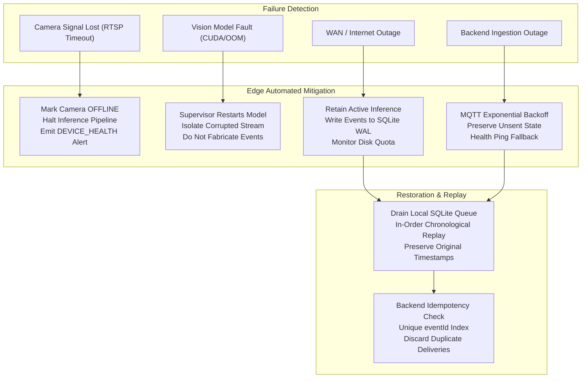

# docs/architecture/failure-architecture.md — Failure & Recovery Architecture

> **FAULT-TOLERANT EDGE & CLOUD RELIABILITY CONSTITUTION**
> 
> Physical retail environments present harsh operational conditions: network outages, camera disconnections, hardware overheating, and intermittent power. This document defines the failure modes, isolation boundaries, and automated recovery strategies across Retail Intelligencia.

---

## 1. Core Reliability Invariant

The fundamental principle governing system failure is:

> **Fail Safe, Never Fabricate, Buffer Locally, Deduplicate Globally.**

Under no circumstances should the system fabricate synthetic detections, emit hallucinated retail events, or silently drop operational records during hardware or network degradation.

---

## 2. Failure Scenarios and Recovery Strategies



---

## 3. Detailed Failure Mode Analysis

### 3.1 Camera Disconnection or Stream Degradation
* **Trigger Condition**: RTSP connection timeout (>5 seconds without keyframe), socket EOF, or RTSP 404/503 response.
* **Immediate System Response**:
  1. The edge ingestion worker marks the camera status as `OFFLINE` in local memory.
  2. The inference pipeline for that specific video channel is paused.
  3. The edge device **immediately ceases emitting retail events for zones associated with that camera**.
  4. The system **never outputs synthetic bounding boxes or simulated events** to fill the gap.
  5. The health daemon constructs and queues a `DEVICE_HEALTH` telemetry payload indicating `cameraStatus: "DISCONNECTED"` for the specific `cameraId`.
* **Automated Recovery**:
  * The stream worker executes an exponential backoff reconnect routine (1s, 2s, 4s, 8s, up to 30s ceiling).
  * Upon RTSP reconnection and receipt of a valid SPS/PPS keyframe, camera status transitions to `ONLINE` and inference resumes.

### 3.2 Vision Model or Process Crash
* **Trigger Condition**: CUDA out-of-memory (OOM), TensorRT engine fatal exception, or process segmentation fault.
* **Immediate System Response**:
  1. The system process supervisor (systemd / Docker daemon with `restart: always`) traps the exit code.
  2. Hardware watchdog timers prevent process deadlocks.
  3. No retail events are generated while the model is recovering.
  4. A `DEVICE_HEALTH` event is flagged with `modelStatus: "RESTARTING"`.
* **Automated Recovery**:
  * The supervisor restarts the computer vision daemon.
  * The daemon validates available GPU memory and re-initializes the TensorRT/ONNX engine.
  * Once the warmup inference cycle passes, the engine resumes normal processing.

### 3.3 Network Outage (Store WAN Partition)
* **Trigger Condition**: Edge node loses TCP connectivity to the central MQTT broker or gateway.
* **Immediate System Response**:
  1. The edge device **continues local video capture, model inference, and event generation without interruption**.
  2. The MQTT client transitions to `DISCONNECTED` state and initiates background reconnection attempts.
  3. The retail rule engine diverts all synthesized `RetailEvent` envelopes into the local embedded SQLite disk buffer.
  4. The local SQLite buffer is configured in `WAL` (Write-Ahead Logging) mode with `PRAGMA synchronous = NORMAL` to guarantee durability against power loss.
* **Storage Quota & FIFO Management**:
  * Default local buffer allocation: 4 GB (sufficient to store ~5,000,000 JSON events, or weeks of offline store operation).
  * If local disk consumption exceeds 90% capacity, the buffer transitions to FIFO eviction, logging a critical disk capacity warning.
* **Automated Recovery (Re-synchronization)**:
  1. Upon WAN restoration and successful MQTT TLS handshake, the buffer drain worker initiates event playback.
  2. Events are read in chronological order (`ORDER BY timestamp ASC`).
  3. Events are published over MQTT with `QoS 1`.
  4. The local record is only deleted or marked `DELIVERED` upon receiving the MQTT `PUBACK` from the broker.
  5. Playback is rate-limited (e.g., maximum 50 events/sec) to avoid overwhelming backend ingestion pipelines.

### 3.4 Backend / Database Outage
* **Trigger Condition**: FastAPI Device Gateway or PostgreSQL database experiences downtime or maintenance.
* **Immediate System Response**:
  * The MQTT broker continues buffering in-flight messages within broker memory/storage.
  * If the broker is unreachable, the edge node's local SQLite buffer absorbs all events.
  * Edge operations remain completely unaffected.

---

## 4. Idempotency & Deduplication Architecture

Because the edge device uses `QoS 1` (At Least Once delivery) and replays buffered records after network reconnects, **duplicate event delivery to the backend is guaranteed to occur**.

### Deduplication Implementation:
1. **Canonical `eventId` as Unique Key**: Every event generated by the edge contains a globally unique ULID / UUIDv7 string (e.g., `evt_01J98X7Z8K3M0W4V8R9N1P2Q3R`).
2. **Database Constraint**: The PostgreSQL `Event` table enforces a strict `UNIQUE(event_id)` constraint backed by a B-tree index.
3. **Ingestion Logic**:
   * When FastAPI or the Data Service receives an event, it executes an idempotent upsert:
     ```sql
     INSERT INTO "Event" (event_id, event_version, event_type, device_id, store_id, zone_id, timestamp, confidence, severity, metadata, source)
     VALUES ($1, $2, $3, $4, $5, $6, $7, $8, $9, $10, $11)
     ON CONFLICT (event_id) DO NOTHING
     RETURNING id;
     ```
   * If the row already exists (zero rows returned), the system recognizes the event as a duplicate.
   * **The duplicate event is immediately acknowledged, but all downstream side-effects (creating alerts, dispatching staff tasks, incrementing traffic counts) are skipped.**

---

## 5. Failure Recovery Summary Matrix

| Failure Point | Detection Mechanism | Edge Behavior | Backend Behavior | Recovery Verification |
| :--- | :--- | :--- | :--- | :--- |
| **Camera RTSP Drop** | RTSP socket timeout (5s) | Mark OFFLINE, pause vision, emit HEALTH | Flags camera offline in UI | Clean reconnection on next valid keyframe |
| **Edge GPU OOM** | CUDA exception catch | Process restart by systemd | Retains last known state | Successful warmup inference cycle |
| **Store WAN Loss** | MQTT keep-alive timeout | Continue vision, buffer to SQLite WAL | Marks device unreachable | Orderly queue drain with PUBACK receipt |
| **Cloud DB Down** | HTTP 500 / TCP reset | Exponential backoff, buffer retained | Reconnects connection pool | Zero duplicate tasks via `eventId` index |
| **Power Outage** | Sudden hardware shutoff | Hardware RTC + systemd restart | Alerts device unresponsive | SQLite WAL recovery check on boot |
