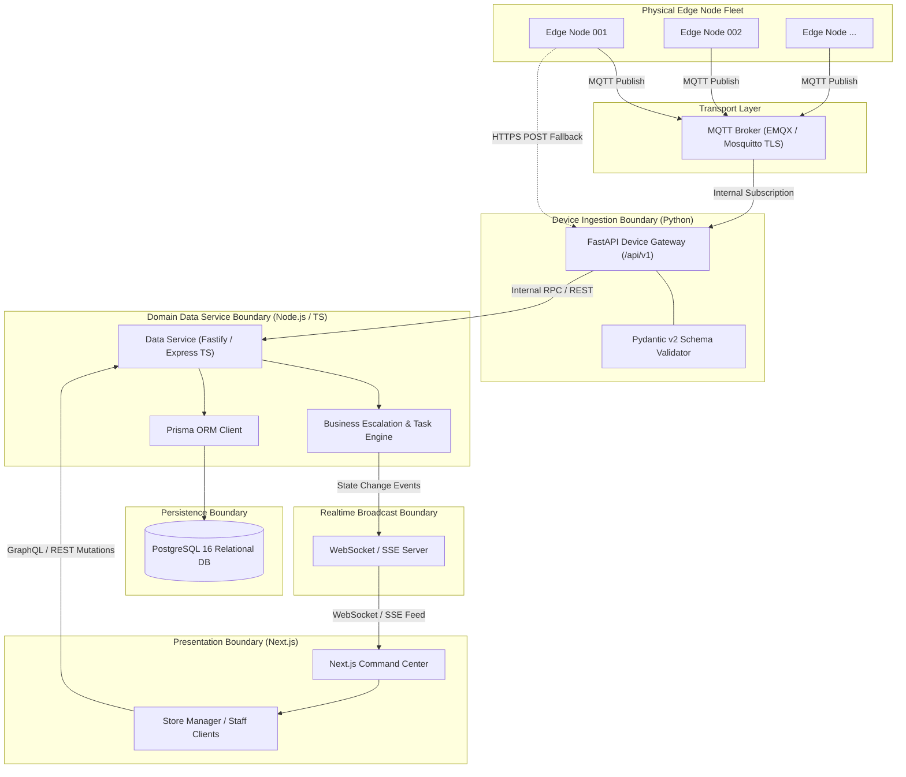

# docs/architecture/service-boundaries.md — Service Boundaries Specification

> **BACKEND & DATA SERVICE ARCHITECTURAL CONSTITUTION**
> 
> This document defines the technical boundaries, communication protocols, and technology stacks separating the FastAPI Device Gateway, the Node.js/TypeScript Data Service, the PostgreSQL database, and the presentation layer.

---

## 1. Architectural Stack Overview

The software backend follows a strictly decoupled service architecture designed to balance high-concurrency IoT ingestion with robust, type-safe enterprise data modeling:



---

## 2. The Strict Python / Prisma Invariant

> **CRITICAL ARCHITECTURAL DIRECTIVE**
> 
> Under no circumstances may Python or FastAPI execute Prisma queries or access the database via Prisma client bindings.
> 
> The stack strictly enforces:
> ```text
> FastAPI Device Gateway
>       ↓
> Node.js / TypeScript Data Service
>       ↓
> Prisma ORM
>       ↓
> PostgreSQL Database
> ```

### Rationale:
1. **Schema Authority**: Prisma is fundamentally optimized for TypeScript/Node.js, offering end-to-end type safety, migration toolchains, and schema synchronization. Using unofficial Python bindings introduces runtime volatility and synchronization drift.
2. **Separation of Concerns**: The FastAPI service is an ultra-fast, asynchronous network gateway dedicated to device authorization, heartbeat consumption, and protocol translation. The Node.js Data Service manages complex business domain rules, task lifecycles, and relational transactions.
3. **Fault Isolation**: An edge telemetry storm or corrupted sensor stream processed by FastAPI will never lock database connections or block UI queries being executed by the Node.js Data Service.

---

## 3. Service Boundary Definitions

### 3.1 Device Gateway Service (FastAPI / Python)
* **Primary Language**: Python 3.11+
* **Primary Framework**: FastAPI + Uvicorn
* **Core Responsibilities**:
  * Consumes MQTT messages from the local/cloud broker.
  * Terminates HTTP fallback requests at `/api/v1/events` and `/api/v1/devices/*`.
  * Authenticates physical edge appliances using device tokens or mTLS certificate thumbprints.
  * Validates raw JSON payloads against strict Pydantic v2 `RetailEvent` schemas.
  * Discards malformed or unauthorized telemetry at the perimeter.
  * Forwards validated events to the Node.js Data Service via high-speed internal HTTP/REST or gRPC.

### 3.2 Data Service (Node.js / TypeScript)
* **Primary Language**: TypeScript (Node.js 20+ LTS)
* **Primary Framework**: Fastify or NestJS
* **ORM**: Prisma ORM 5.x+
* **Core Responsibilities**:
  * Owns the official Prisma schema (`schema.prisma`) and executes all database migrations.
  * Enforces event deduplication using the unique `eventId` index.
  * Persists incoming events, alerts, tasks, store layouts, and user records.
  * Executes the **Business Escalation Engine**:
    * Cooldown checking: Prevents multiple alerts for the same zone within a 5-minute window.
    * Priority assignment: Maps event severity to operational staff urgency.
    * Task generation: Converts events into actionable work items for floor staff.
  * Serves client CRUD and GraphQL/REST queries originating from the Next.js frontend.
  * Publishes state change notifications to the Realtime Hub.

### 3.3 Relational Persistence Layer (PostgreSQL)
* **Engine**: PostgreSQL 16+
* **Core Responsibilities**:
  * Master relational store for all entities (`Store`, `Device`, `Camera`, `Zone`, `Event`, `Alert`, `Task`, `User`).
  * Time-series optimization via BRIN indexes on `timestamp` columns.
  * ACID transaction isolation for task assignments and status transitions.
  * Partitioning strategies for high-volume historical event logs.

### 3.4 Realtime Notification Hub (Node.js / WebSocket / SSE)
* **Technology**: WebSockets (`ws`) or Server-Sent Events (SSE)
* **Core Responsibilities**:
  * Maintains persistent, authenticated client connections to active browser sessions.
  * Channels updates by store scope (`store_{storeId}`).
  * Pushes live events, alert popups, and task status changes with sub-100ms latency.
  * Emits heartbeat keep-alives to detect disconnected client tabs.

### 3.5 Presentation Layer (Next.js)
* **Technology**: Next.js 14+ (App Router), React, Vanilla CSS / TailwindCSS.
* **Core Responsibilities**:
  * Server-side renders secure, authenticated operational layouts.
  * Renders interactive SVG/Canvas digital twins of store zones.
  * Subscribes to the Realtime Hub for live telemetry.
  * Executes task mutation requests (`assign`, `complete`) against the Node.js Data Service.

---

## 4. Inter-Service Communication Contracts

| Boundary Interface | Protocol | Payload Format | Authentication |
| :--- | :---: | :---: | :---: |
| **Edge Node ──► MQTT Broker** | MQTT 5.0 (TLS) | Canonical `RetailEvent` JSON | mTLS / Device Token |
| **Edge Node ──► FastAPI (Fallback)**| HTTPS | Canonical `RetailEvent` JSON | Bearer Device Token |
| **FastAPI ──► Node.js Data Service** | HTTP/2 (Internal)| Validated Event JSON | Internal Mutual Secret |
| **Node.js Data Service ──► Postgres**| PostgreSQL Wire | Parameterized SQL (Prisma) | DB Credentials / TLS |
| **Node.js Data Service ──► Realtime**| In-memory / Redis | Internal Event DTO | Local socket / Secret |
| **Realtime Hub ──► Next.js Client** | WebSocket / SSE | Normalized Notification JSON | JWT Bearer Cookie |
| **Next.js Client ──► Data Service** | HTTPS REST | Standard DTO Requests | User JWT Session |
