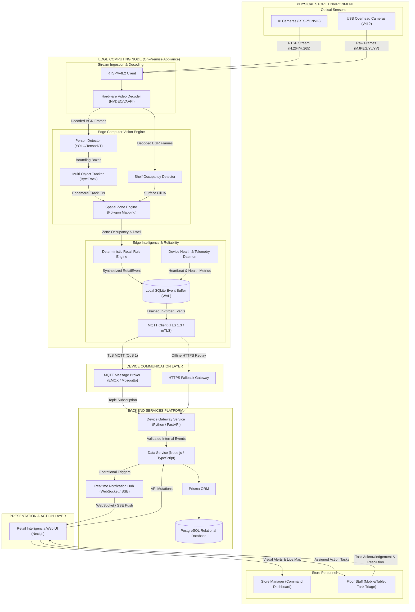

# docs/architecture/system-architecture.md — System Architecture Specification

> **RETAIL INTELLIGENCIA ARCHITECTURAL CONSTITUTION**
> 
> This document defines the canonical end-to-end system architecture of Retail Intelligencia, establishing the structural relationships between physical hardware sensors, edge computing nodes, communication buses, backend services, persistence layers, realtime event distribution, and user action interfaces.

---

## 1. Architectural Philosophy: Hardware-First Physical AI

Retail Intelligencia is designed as a **hardware-first edge AI system**. The physical edge computing appliance deployed inside the retail store is the core operational engine. The system operates on the fundamental principle:

```text
PHYSICAL STORE ──► SENSE ──► UNDERSTAND ──► DECIDE ──► ACT
```

1. **Physical Store**: The real-world retail environment containing shoppers, aisles, shelves, checkout lanes, and inventory.
2. **Sense**: Optical sensors (IP cameras over RTSP and USB cameras over V4L2) continuously observe the physical scene.
3. **Understand**: Dedicated on-premise edge AI hardware captures, decodes, and runs deep neural network models (person detection, multi-object tracking, and shelf occupancy estimation).
4. **Decide**: The edge retail rule engine correlates detections across spatial zones and time windows, evaluating deterministic thresholds to produce canonical `RetailEvent` envelopes.
5. **Act**: The cloud/on-premise backend persists the event, evaluates business escalation policies, generates alerts, and dispatches real-time tasks to store managers and floor personnel.

---

## 2. Canonical Architecture Diagram



---

## 3. Layer-by-Layer Architectural Breakdown

### 3.1 Physical Store & Sensor Ingestion Layer
* **IP Cameras**: Standard security and surveillance cameras streaming RTSP over the local store VLAN.
* **USB Overhead Cameras**: Direct plug-and-play USB cameras covering checkout lanes or specific display endcaps.
* **Stream Decoupling**: Streams are decoded in-memory using dedicated hardware acceleration (e.g., NVDEC on NVIDIA platforms or VA-API on x86). Raw frames are never written to disk or transmitted over WAN.

### 3.2 Edge AI Hardware Node (Appliance)
* **Compute Platform**: Ruggedized on-premise industrial PC or AI compute module (e.g., NVIDIA Jetson Orin or Intel Core Ultra with discrete NPU/GPU).
* **Vision Models**:
  * *Person Detection*: Identifies shoppers, staff, and queue lines.
  * *Shelf Occupancy*: Evaluates shelf compartment fill percentages.
  * *Tracking*: Maintains temporary spatial continuity (`track_id`) solely across consecutive frames to compute dwell times and queue progressions.
* **Zone Engine**: Projects image-space coordinates into calibrated floor-plan polygonal zones (e.g., `zone_aisle_04`, `zone_checkout_02`).
* **Retail Rule Engine**: Evaluates state machines and debounced threshold logic to generate canonical `RetailEvent` envelopes.
* **Local Buffer**: Embedded SQLite database operating in Write-Ahead Logging (WAL) mode. Buffers all generated events locally so that zero data is lost during store internet disconnections.

### 3.3 Device Communication Layer
* **Primary Protocol**: MQTT 5.0 / 3.1.1 over TLS (port 8883) with mutual certificate authentication (mTLS) or per-device pre-shared cryptographic tokens.
* **Topic Structure**: Hierarchical namespace `retail/{environment}/{storeId}/{deviceId}/...` ensuring complete tenant and store isolation.
* **Quality of Service (QoS)**: QoS 1 (At least once delivery) for events and health telemetry; QoS 0 for high-frequency heartbeats; QoS 2 for remote device control commands.

### 3.4 Backend Services Platform
* **Device Gateway (FastAPI)**: Lightweight, high-throughput Python service responsible for validating inbound MQTT and HTTPS payloads against strict Pydantic schemas, managing device registration, and ingesting telemetry.
* **Data Service (Node.js / TypeScript)**: Core domain business logic, task workflow orchestration, alert escalation, and database interface via Prisma ORM.
* **Database (PostgreSQL)**: Fully normalized relational persistence storing stores, devices, zones, canonical events, alerts, tasks, and audit logs.
* **Realtime Hub**: Low-latency notification layer broadcasting live updates via WebSocket or SSE to authenticated dashboard clients.

### 3.5 Presentation & Human Action Layer
* **Next.js Web Application**: Server-rendered and client-hydrated responsive command center providing:
  * Store digital twin and zone heatmap.
  * Real-time operational alert feeds.
  * Staff task dispatch and lifecycle tracking.
  * Device fleet health and camera monitoring.

---

## 4. Fundamental Architectural Invariants

Every component and engineer on the platform must maintain the following architectural invariants:

1. **Zero Video Egress**: Raw video frames and high-rate video streams **must never exit the physical retail store network** during standard operations. Only metadata JSON packets leave the store.
2. **Edge Independence**: The edge node must be fully autonomous. If the cloud backend, internet connection, or local router fails, edge inference and event buffering continue unabated.
3. **Canonical Event Unification**: No component may create an alternative event envelope. Every edge-generated insight must match the common `RetailEvent` contract.
4. **Service Boundary Separation**: FastAPI is the device gateway; Node.js/TypeScript is the data domain service. Python services must never directly execute Prisma ORM commands.
5. **No Biometrics or Re-Identification**: Tracking IDs are ephemeral and strictly intra-camera. Facial recognition and customer profiling are permanently prohibited.
