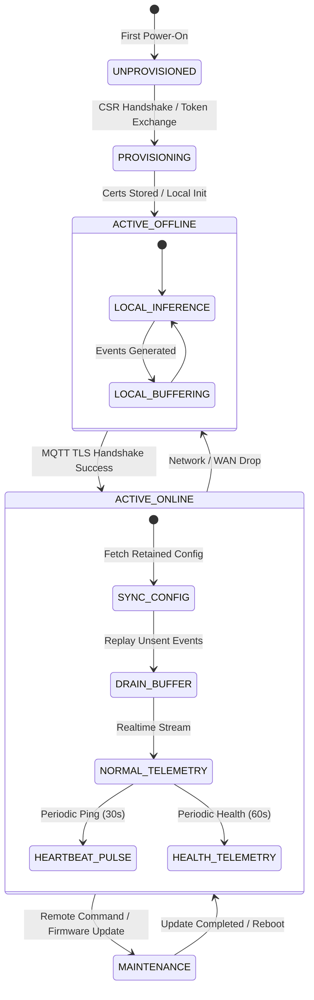

# docs/contracts/device-protocol.md — Device Communication Protocol

> **EDGE DEVICE LIFECYCLE & PROTOCOL STATE MACHINE**
> 
> This document defines the operational protocol for edge appliances, specifying the device provisioning handshake, heartbeat cadence, health telemetry, offline buffering, and network recovery flows.

---

## 1. Device Lifecycle State Machine

An edge computing appliance operates according to a strict finite-state machine (FSM):



---

## 2. Device Provisioning & Enrollment Flow

Before an edge appliance can emit telemetry or consume store configurations, it must be provisioned with cryptographic credentials:

1. **Factory Staging**:
   * Hardware is imaged with the Retail Intelligencia base Linux OS and runtime daemons.
   * A unique physical identifier is bound to the appliance: `deviceId` (derived from TPM 2.0 cryptographic chip or MAC address).
2. **Registration Request**:
   * When connected to the retail store network for the first time, the device issues an HTTPS enrollment request:
     ```http
     POST /api/v1/devices/register
     Host: api.retail-intelligencia.io
     Content-Type: application/json
     
     {
       "deviceId": "edge_001",
       "storeId": "store_001",
       "hardwareModel": "Jetson-Orin-NX-16GB",
       "macAddress": "00:04:4B:EA:91:22",
       "csr": "-----BEGIN CERTIFICATE REQUEST-----\n..."
     }
     ```
3. **Approval & Credential Issuance**:
   * Platform Administrator approves the device registration via the dashboard or pre-shared provisioning token.
   * Gateway returns a signed X.509 client certificate, the intermediate CA bundle, and broker connection endpoints.
4. **Credential Storage**:
   * Certificates and private keys are saved to encrypted local storage (`/etc/retail-intelligencia/certs/`).
   * Appliance initializes the MQTT TLS connection over port 8883.

---

## 3. Heartbeat Protocol

To verify edge node liveness without placing unnecessary load on the MQTT broker or backend ingestion workers, devices emit a lightweight heartbeat ping:

* **Protocol & Topic**: MQTT `retail/{env}/{storeId}/{deviceId}/heartbeat` (QoS 0).
* **HTTP Fallback**: `POST /api/v1/devices/{deviceId}/heartbeat` if MQTT connection is blocked by strict local firewalls.
* **Cadence**: Every 30 seconds (±2s jitter to avoid synchronized fleet storms).
* **Liveness Evaluation**:
  * If a heartbeat is received within 60 seconds: Device is marked **ONLINE** (`HEALTHY`).
  * If no heartbeat is received for 90 seconds: Device is flagged **DEGRADED**.
  * If no heartbeat is received for 180 seconds: Device is marked **OFFLINE**, and an incident is raised on the manager dashboard.

---

## 4. Hardware Health Telemetry

Hardware telemetry provides continuous diagnostic visibility into the physical edge appliance:

* **Protocol & Topic**: MQTT `retail/{env}/{storeId}/{deviceId}/health` (QoS 1, Retain True).
* **Cadence**: Every 60 seconds, or immediately triggered upon hardware fault.
* **Monitored Subsystems**:
  1. **CPU & RAM**: Core load percentage, system memory usage, swap file usage.
  2. **GPU / NPU Acceleration**: TensorRT execution utilization, video decoder (NVDEC) usage.
  3. **Thermals**: SoC junction temperature, GPU core temperature. If temp > 85°C, thermal throttling alert is emitted.
  4. **Disk Quota**: Local NVMe storage usage, SQLite buffer file size, write speed.
  5. **Camera Stream Watchdog**: For every connected camera, tracks FPS, keyframe arrival, packet drop percentage, and decoding errors.
  6. **Model Watchdog**: Real-time average inference latency (ms), frame drop count, and process health.

---

## 5. Network Partition & Offline Buffering Protocol

> **INDEPENDENCE PRINCIPLE**: Inference and event generation must NEVER depend on constant cloud connectivity.

When the retail store loses internet connectivity:
1. **Local Isolation**: The edge inference engine continues decoding video frames, tracking people, evaluating shelf occupancy, and synthesizing `RetailEvent` envelopes.
2. **Buffer Persistence**: Events are written to the local SQLite embedded database:
   ```sql
   INSERT INTO event_buffer (event_id, timestamp, payload, delivery_status)
   VALUES ('evt_01J98...', '2026-09-05T10:30:00Z', '{"eventId":...}', 'PENDING');
   ```
3. **Reconnection & Drain Engine**:
   * The MQTT client runs an exponential backoff reconnect loop (initial 2s, maximum 60s).
   * Upon successful TLS reconnection and authentication, the drain engine queries unsent events:
     ```sql
     SELECT * FROM event_buffer 
     WHERE delivery_status = 'PENDING' 
     ORDER BY timestamp ASC 
     LIMIT 50;
     ```
   * Events are published sequentially to `retail/{env}/{storeId}/{deviceId}/events` with `QoS 1`.
   * Upon receiving `PUBACK`, the row is marked `DELIVERED` or deleted.
   * Playback throughput is throttled to a maximum of 50 events/second to prevent overwhelming the backend.
   * Original timestamps are strictly preserved in the event payload.
