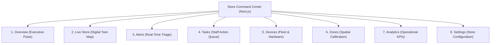
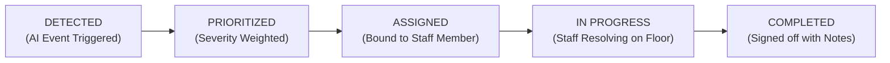

# docs/dashboard/information-architecture.md — Dashboard Information Architecture

> **STORE COMMAND CENTER NAVIGATION & USER EXPERIENCE SPECIFICATION**
> 
> This document specifies the screen hierarchy, layout structures, visual widgets, and operational flows for the Retail Intelligencia Next.js web application.

---

## 1. Top-Level Navigation Hierarchy

The command center is organized into 8 functional modules designed around operational urgency:

---

## 2. Screen Specifications & Widget Layouts

### 2.1 Overview (Operational Pulse)
* **Primary Purpose**: Single-pane-of-glass executive summary for Store Managers on store floor health.
* **Core Widgets**:
  1. **Shopper Headcount Card**: Estimated live patrons on floor, trending vs last week.
  2. **Active Queue Bottlenecks Card**: Number of open registers with queue depth > threshold.
  3. **Critical Shelf Out-of-Stock Card**: Count of bare shelves requiring immediate replenishment.
  4. **Unresolved Tasks Progress**: Progress bar (Pending / In Progress / Completed today).
  5. **Hardware Fleet Status**: Green/Yellow/Red indicator of edge appliance and camera health.
  6. **Recent Event Feed**: Chronological ticker of live `RetailEvent` envelopes streaming in real-time.

---

### 2.2 Live Store (Digital Twin View)
* **Primary Purpose**: Interactive 2D floor-plan visualization rendering in-store zones and optical states.
* **Core Widgets**:
  * **Interactive Zone Canvas**: SVG/Canvas layout of the supermarket aisles, produce sections, and checkout banks.
  * **Zone Visual States**:
    * *Green*: Normal occupancy, optimal stock, low queue.
    * *Yellow*: Approaching thresholds (e.g. queue = 5, shelf fill = 30%).
    * *Red Pulsing*: Breached thresholds (`QUEUE_HIGH`, `SHELF_EMPTY`).
  * **Hover Detail Flyout**: Displays zone name, attached camera ID, current headcount, average dwell time, and model confidence score.

---

### 2.3 Alerts (Real-Time Operational Triage)
* **Primary Purpose**: Rapid triage feed answering the five essential operational questions for every alert:
  1. **What happened?** (e.g., `QUEUE_HIGH` — 8 patrons waiting).
  2. **Where?** (Checkout Lane 2, Camera 2).
  3. **When?** (Detected at 10:30:00 UTC, elapsed duration: 2m 15s).
  4. **How confident?** (94% confidence score from vision model).
  5. **What should staff do?** ("Open Register 3 immediately to absorb surge").
* **Actions**:
  * `[Acknowledge]`: Changes state to `ACKNOWLEDGED`, stopping alarm sound.
  * `[Create Task]`: Automatically opens pre-populated staff assignment modal.
  * `[Dismiss]`: Requires selecting a reason (e.g., "False positive", "Known maintenance").

---

### 2.4 Tasks (Staff Workflow System)
* **Primary Purpose**: Operational task management tracking physical staff remediation through 5 lifecycle stages:

* **Core Views**:
  * **Kanban Board**: Drag-and-drop columns for Store Managers.
  * **Mobile Triage List**: Large, accessible touch buttons for floor staff tablets and smartphones.

---

### 2.5 Devices (Hardware Fleet Management)
* **Primary Purpose**: Real-time health monitoring of physical on-premise edge appliances.
* **Core Widgets**:
  * Appliance Status Table: `deviceId`, online status, IP address, uptime.
  * Hardware Thermals & Load: Real-time gauges for CPU utilization, GPU TensorRT load, and SoC temperature.
  * Camera Link Status: Grid showing each attached camera, RTSP status, frame rate (FPS), and dropped frame percentage.
  * Remote Diagnostic Actions: `[Ping]`, `[Restart Inference Worker]`, `[Export Diagnostic Logs]`.

---

### 2.6 Zones (Spatial Calibration Tool)
* **Primary Purpose**: Visual editor allowing Store Managers to draw and calibrate spatial polygons over reference camera stills.
* **Core Tools**:
  * Polygon Vertex Editor: Click-to-add vertices defining aisle corridors, checkout lines, and shelf bays.
  * Zone Type Selector: `QUEUE`, `SHELF`, `TRAFFIC_AISLE`, `DWELL_AREA`.
  * Threshold Sliders: Configure headcount limits, dwell seconds, and low-stock percentage triggers.
  * Save & Push: Publishes updated geometry directly to the edge appliance via MQTT `/config`.

---

### 2.7 Analytics (Operational KPIs)
* **Primary Purpose**: Actionable business intelligence derived from aggregated historical event data.
* **Strict Rule**: **No decorative charts without operational meaning**. Every metric must tie to labor efficiency or revenue preservation.
* **Approved KPI Visualizations**:
  * **Shelf Stockout Frequency & Duration**: Hours lost per department to out-of-stock items.
  * **Queue Waiting Time Distribution**: Average wait seconds by hour of day across checkout lanes.
  * **Staff Resolution Latency**: Average minutes from alert generation to task completion.
  * **Department Footfall vs Dwell Time**: Scatter plot identifying high-traffic, low-dwell aisles (dead zones).

---

### 2.8 Settings (Store & System Configuration)
* **Primary Purpose**: Store metadata, notification dispatch preferences, and user role management.
* **Settings Panels**: Store operating hours, audio alert tones, SMS/Push notification webhooks, staff accounts.
