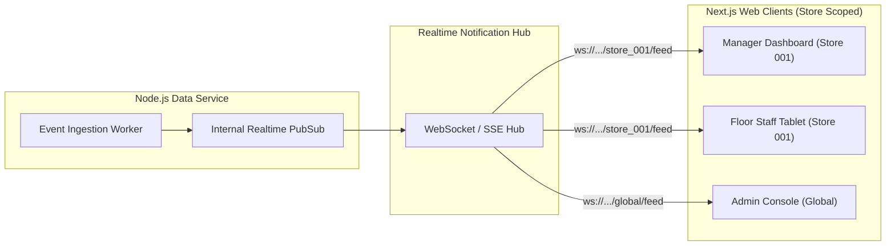

# docs/dashboard/realtime-data.md — Realtime Data Architecture Specification

> **LOW-LATENCY CLIENT SYNCHRONIZATION & EVENT BROADCAST**
> 
> This document specifies the real-time push protocols, WebSocket/SSE subscription channels, state reconciliation routines, and client UI rendering optimizations connecting the backend to browser dashboards.

---

## 1. Real-Time Transport Architecture

To deliver sub-second situational awareness to store managers without saturating browser network sockets:



---

## 2. Channel Taxonomy & Payloads

Clients connect to the real-time hub via WebSockets (`wss://api.retail-intelligencia.io/v1/realtime`) authenticating with their user session token. Clients subscribe to specific channel streams:

### 2.1 Channel: `store:{storeId}:alerts`
* **Purpose**: Pushes immediate operational alerts triggering audio chimes and red visual banners.
* **Payload**:
  ```json
  {
    "type": "ALERT_TRIGGERED",
    "alertId": "alt_01J98...",
    "alertType": "QUEUE_HIGH",
    "severity": "HIGH",
    "zoneId": "zone_checkout_02",
    "message": "Checkout 02 Queue > 6 patrons",
    "timestamp": "2026-09-05T10:30:00Z"
  }
  ```

### 2.2 Channel: `store:{storeId}:tasks`
* **Purpose**: Synchronizes Kanban board and staff assignment lists across all active store devices.
* **Payload**:
  ```json
  {
    "type": "TASK_UPDATED",
    "taskId": "tsk_01J98...",
    "status": "IN_PROGRESS",
    "assignedToUserId": "usr_staff_102",
    "timestamp": "2026-09-05T10:31:00Z"
  }
  ```

### 2.3 Channel: `store:{storeId}:zones`
* **Purpose**: Throttled zone heatmap occupancy updates (pushed maximum once every 2 seconds per zone).
* **Payload**:
  ```json
  {
    "type": "ZONE_TELEMETRY",
    "zoneId": "zone_produce_01",
    "currentOccupancy": 12,
    "status": "NORMAL",
    "timestamp": "2026-09-05T10:30:02Z"
  }
  ```

---

## 3. Reconnection & State Reconciliation

Browsers running on mobile tablets or store computers experience sleep states, Wi-Fi handoffs, and background tab throttling:

1. **Heartbeat Pings**: The WebSocket server transmits a ping packet every 15 seconds. If the client misses two consecutive pings, it marks the socket `DISCONNECTED`.
2. **Exponential Backoff Reconnect**: The client attempts reconnection at 1s, 2s, 4s, 8s intervals (capped at 30s).
3. **State Reconciliation Routine (Catch-Up REST Fetch)**:
   * When the WebSocket connection re-establishes, the client does not rely solely on missed WebSocket messages.
   * The client immediately issues a lightweight REST synchronization query:
     ```http
     GET /api/v1/alerts?storeId=store_001&status=ACTIVE&since=2026-09-05T10:28:00Z
     GET /api/v1/tasks?storeId=store_001&since=2026-09-05T10:28:00Z
     ```
   * The client UI merges any state changes that transpired while offline.

---

## 4. Client-Side Rendering Optimization

* **Virtual DOM Throttling**: A busy supermarket produces continuous footstep events. If the React dashboard re-renders upon every raw detection, browser framerate degrades rapidly.
* **Rendering Buffer**: Raw zone telemetry is batched into a 1-second animation frame buffer (`requestAnimationFrame`). SVG zone color transitions and headcount numbers are smoothly interpolated rather than abruptly redrawn.
