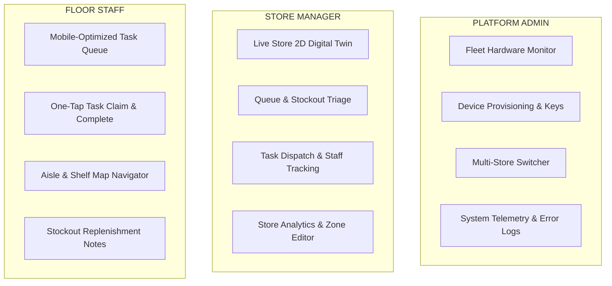

# docs/dashboard/user-roles.md — Dashboard User Roles Specification

> **ROLE-TAILORED OPERATIONAL USER EXPERIENCES**
> 
> The dashboard delivers distinct user interfaces optimized for the physical responsibilities of each retail user tier: Platform Admins managing hardware fleets, Store Managers commanding in-store execution, and Floor Staff resolving physical issues.

---

## 1. Persona Mapping & Core Responsibilities



---

## 2. Store Manager Experience: Command Center

* **Primary Hardware**: Desktop PC / 24-inch POS monitor located in the store manager's office or customer service desk.
* **Key Screen Layout**:
  ```text
  ┌────────────────────────────────────────────────────────────────────────┐
  │ RETAIL INTELLIGENCIA  | Store 001 - Market St | Active Shoppers: 142   │
  ├───────────────────────────────────┬────────────────────────────────────┤
  │ [LIVE DIGITAL TWIN STORE MAP]     │ [ACTIVE OPERATIONAL ALERTS (3)]    │
  │                                   │                                    │
  │  ┌──────────┐   ┌──────────┐      │ 🔴 Checkout 02: Queue > 6 (Wait 4m)│
  │  │ Aisle 01 │   │ Aisle 02 │      │    [Acknowledge] [Assign Task]     │
  │  │ (Normal) │   │ (Normal) │      │                                    │
  │  └──────────┘   └──────────┘      │ 🟡 Aisle 04-B: Cereal Fill < 20%   │
  │  ┌──────────┐   ┌──────────┐      │    [Acknowledge] [Assign Task]     │
  │  │ Aisle 03 │   │ Aisle 04 │      │                                    │
  │  │ (Dwell)  │   │ 🔴 LOW   │      ├────────────────────────────────────┤
  │  └──────────┘   └──────────┘      │ [ACTIVE STAFF ON DUTY (4)]         │
  │  ═══════════════════════════      │  • Maria G. (Produce - Idle)       │
  │   [Checkout 01] [Checkout 02]🔴   │  • John D. (Aisle 2 - Busy)        │
  │                                   │  • Alex R. (Register 1 - Active)   │
  └───────────────────────────────────┴────────────────────────────────────┘
  ```
* **Core Interaction Workflow**:
  1. Alert sounds when Queue exceeds 6 patrons.
  2. Manager views Register 2 highlighted in pulsing red on the digital twin map.
  3. Manager clicks `[Assign Task]`, selects "Maria G.", and dispatches: "Open Register 3".
  4. Manager observes queue count normalize to green as Maria begins servicing customers.

---

## 3. Floor Staff Experience: Mobile Task Triage

* **Primary Hardware**: Ruggedized store mobile handheld (Zebra, Honeywell) or retail tablet.
* **Key Screen Layout**:
  ```text
  ┌────────────────────────────────────────┐
  │ 📱 RETAIL INTELLIGENCIA (STAFF VIEW)   │
  │ Associate: Maria Garcia | Zone: Center │
  ├────────────────────────────────────────┤
  │ 🔔 NEW TASK ASSIGNED (HIGH PRIORITY)   │
  │                                        │
  │ Task: Restock Cereal Facing 04-B       │
  │ Location: Aisle 04, Middle Bay         │
  │ Detected: 2 mins ago (Stockout Risk)   │
  │ Units to Restock: ~24 boxes            │
  │                                        │
  │   [ ▶ CLAIM & START TASK ]             │
  │                                        │
  ├────────────────────────────────────────┤
  │ COMPLETED TODAY (6 Tasks)              │
  │  ✓ Restocked Dairy Bay 2 (10:15 AM)    │
  │  ✓ Assisted Customer Aisle 1 (09:40 AM)│
  └────────────────────────────────────────┘
  ```
* **Core Interaction Workflow**:
  1. Handheld vibrates upon task assignment.
  2. Associate clicks `[CLAIM & START TASK]`.
  3. Associate retrieves inventory from backroom and restocks the shelf.
  4. Associate clicks `[COMPLETE TASK]`, optionally enters units restocked, and returns to normal floor patrol.

---

## 4. Platform Administrator Experience: Fleet Command

* **Primary Hardware**: Technical workstation / laptop.
* **Key Capabilities**:
  * Multi-Store Selector: Instant switching between hundreds of physical store branches.
  * Edge Appliance Fleet Grid: Real-time status of every physical appliance across the enterprise, showing firmware version, model latency, GPU temperature, and offline alarms.
  * Cryptographic Credential Manager: Issue and revoke device mTLS certificates and manage rotation schedules.
  * System Log Streamer: Real-time stream of audit events and error payloads.
