# docs/database/data-lifecycle.md — Data Lifecycle & Retention Specification

> **DATA TIERING, RETENTION & PURGE POLICIES**
> 
> High-velocity edge intelligence generates millions of event envelopes per store per month. This document specifies the lifecycle stages, storage tiering, automated aggregation, and data retention policies for Retail Intelligencia.

---

## 1. Storage Tiering Model

To balance low-latency query performance for dashboard operations with cost-effective long-term analytics storage, data transitions through three lifecycle tiers:

```mermaid
flowchart LR
    subgraph HotTier["HOT TIER (PostgreSQL 16)"]
        H1["Active Transactions (0 - 90 Days)"]
        H2["Raw RetailEvent JSON Envelopes"]
        H3["Active & Recent Alerts / Tasks"]
        H4["Sub-10ms Indexed Queries"]
    end

    subgraph WarmTier["WARM TIER (Aggregated Views)"]
        W1["Hourly & Daily Rollups (90 - 365 Days)"]
        W2["Average Wait Times & Traffic Densities"]
        W3["Shelf Stockout Frequencies"]
        W4["Optimized Analytical Reporting"]
    end

    subgraph ColdTier["COLD TIER (Parquet / Object Storage)"]
        C1["Compressed Columnar Archive (> 365 Days)"]
        C2["Long-term Multi-Year Compliance Logs"]
        C3["Aggregated Historical Footfall Trends"]
    end

    HotTier -->|"Automated Nightly Aggregation"| WarmTier
    WarmTier -->|"Annual Parquet Export & Purge"| ColdTier
```



---

## 2. Retention Policies by Entity

| Entity Name | Hot Retention (Postgres) | Warm Retention (Rollups) | Cold Retention (Archive) | Permanent Deletion / Purge |
| :--- | :---: | :---: | :---: | :---: |
| **`Event` (Raw JSON)** | **90 Days** | Aggregated into Hourly stats | Optional Parquet (1 Year) | Purged after 90 days from Hot DB |
| **`Alert`** | **180 Days** | Aggregated into Daily KPI | 3 Years (Compliance log) | Retained for 3 years |
| **`Task` & Resolutions**| **365 Days** | Aggregated into Staff KPI | 3 Years (Labor audits) | Retained for 3 years |
| **`Device` & Health Logs**| **30 Days** (Health) | Monthly uptime rollups | 1 Year | Raw health purged after 30 days |
| **`Store` & `Zone`** | **Indefinite** | Indefinite | Indefinite | Never automatically purged |
| **`User` Accounts** | **Indefinite** | Indefinite | Indefinite | Soft-deleted (`isActive: false`) |

---

## 3. Automated Rollup & Aggregation Routines

At 02:00 UTC daily, a scheduled database background worker runs analytical rollups before purging raw hot data:

1. **Hourly Zone Traffic Rollup**:
   * Computes: `storeId`, `zoneId`, `dateHour`, `totalEntries`, `avgDwellSeconds`, `peakOccupancy`.
2. **Queue Performance Rollup**:
   * Computes: `checkoutId`, `dateHour`, `avgQueueLength`, `maxQueueLength`, `highQueueEventCount`.
3. **Shelf Availability Rollup**:
   * Computes: `shelfId`, `dateDay`, `outOfStockMinutes`, `lowStockMinutes`, `replenishmentCount`.

---

## 4. Hot Tier Partitioning & Purge Execution

To ensure database write throughput never degrades as table sizes grow:
* The PostgreSQL `Event` table uses **range partitioning on the `timestamp` column**:
  ```sql
  CREATE TABLE "Event" (
      id UUID NOT NULL,
      event_id VARCHAR(32) NOT NULL,
      event_type VARCHAR(32) NOT NULL,
      store_id VARCHAR(32) NOT NULL,
      timestamp TIMESTAMPTZ NOT NULL,
      confidence REAL NOT NULL,
      severity VARCHAR(16) NOT NULL,
      metadata JSONB NOT NULL,
      source JSONB NOT NULL,
      received_at TIMESTAMPTZ NOT NULL DEFAULT NOW(),
      PRIMARY KEY (id, timestamp)
  ) PARTITION BY RANGE (timestamp);
  ```
* Partitions are created monthly (e.g. `Event_2026_09`, `Event_2026_10`).
* Purging data older than 90 days executes via instant partition detachment:
  ```sql
  DROP TABLE "Event_2026_06";
  ```
  *This eliminates expensive `DELETE FROM "Event"` queries, preventing table bloat and disk I/O freezes.*
