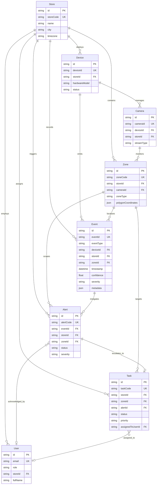

# docs/database/relationships.md — Entity-Relationship Specification

> **RELATIONAL DOMAIN GRAPH & REFERENTIAL INTEGRITY**
> 
> This document specifies the entity relationships, cardinalities, foreign key cascades, and referential integrity constraints governing the PostgreSQL database via Prisma ORM.

---

## 1. Entity-Relationship Diagram (ERD)

---

## 2. Cardinality & Foreign Key Cascade Rules

| Relationship | Parent Entity | Child Entity | Cardinality | Cascade On Delete | Rationale |
| :--- | :--- | :--- | :---: | :---: | :--- |
| `Store_Devices` | `Store` | `Device` | 1 ──► 0..* | **RESTRICT** | Cannot delete a Store that owns active physical hardware. |
| `Device_Cameras` | `Device` | `Camera` | 1 ──► 0..* | **CASCADE** | Deleting a hardware record removes its attached sensor mappings. |
| `Store_Zones` | `Store` | `Zone` | 1 ──► 0..* | **CASCADE** | Store demolition or closure removes its zone polygons. |
| `Camera_Zones` | `Camera` | `Zone` | 1 ──► 0..* | **SET NULL / RESTRICT**| Deleting a camera requires unbinding or migrating active zones. |
| `Store_Events` | `Store` | `Event` | 1 ──► 0..* | **RESTRICT** | Audit trail; historical events cannot be accidentally wiped. |
| `Device_Events` | `Device` | `Event` | 1 ──► 0..* | **RESTRICT** | Hardware event lineage must be preserved for compliance. |
| `Zone_Events` | `Zone` | `Event` | 1 ──► 0..* | **SET NULL** | Re-drawing or deleting a zone preserves past event metrics. |
| `Event_Alerts` | `Event` | `Alert` | 1 ──► 0..* | **RESTRICT** | An alert cannot exist without its originating event envelope. |
| `Alert_Task` | `Alert` | `Task` | 1 ──► 0..1 | **SET NULL** | Deleting or clearing an alert preserves the staff task record. |
| `User_Tasks` | `User` | `Task` | 1 ──► 0..* | **SET NULL** | Terminating or deleting a staff account unassigns active tasks. |
| `Store_Users` | `Store` | `User` | 1 ──► 0..* | **RESTRICT** | Prevent deleting a store with active human user accounts. |

---

## 3. Strict Tenant Isolation Rule

> **MANDATORY DATA BOUNDARY**
> 
> All core transactional queries (`Event`, `Alert`, `Task`, `Zone`) **must filter by `storeId`**. 
> 
> Cross-store queries are permitted exclusively for users holding the `PLATFORM_ADMIN` role. Store Managers and Floor Staff are cryptographically scoped to their assigned `storeId`.
