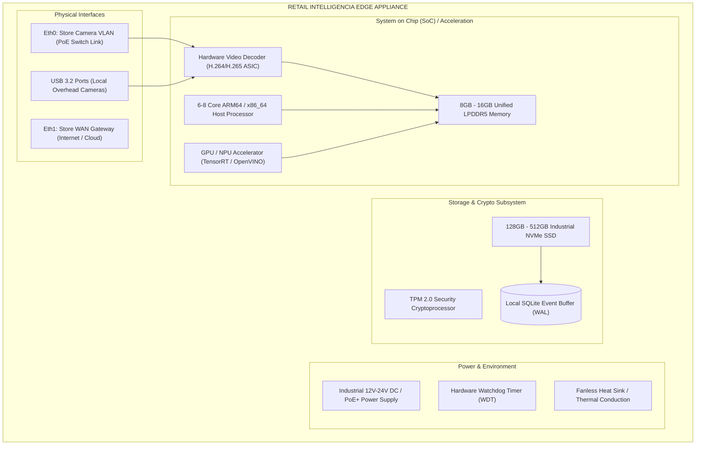

# docs/hardware/edge-device.md — Edge Device Architecture Specification

> **PHYSICAL APPLIANCE ARCHITECTURE & RUNTIME ENVIRONMENT**
> 
> Retail Intelligencia is a hardware-first platform. This document specifies the physical architecture, compute platforms, acceleration hardware, local storage subsystems, and thermal management of the on-premise edge computing appliance.

---

## 1. Physical Appliance Overview

The **Retail Intelligencia Edge Appliance** is a dedicated on-premise industrial computer deployed inside the retail store (typically located in the store communications rack or enclosed in a ceiling mount above camera convergence points).

---

## 2. Reference Compute Platforms

To accommodate varying store sizes and camera densities, Retail Intelligencia defines two approved hardware tiers:

### Tier 1: Compact Branch Appliance (4 – 8 Camera Streams)
* **Reference Platform**: NVIDIA Jetson Orin Nano (8GB) / Orin NX (8GB/16GB) or Intel Core Ultra 5 with integrated Intel Arc / NPU.
* **Target Footprint**: Small grocery stores, boutique retailers, express convenience stores.
* **AI Compute**: 40 to 100 TOPS (INT8 / FP16).
* **Thermal Envelope**: 15W to 25W (fanless, sealed aluminum enclosure).
* **Concurrent Video Feeds**: 4 to 8 concurrent 1080p @ 15fps H.264 streams.

### Tier 2: Enterprise Supermarket Appliance (12 – 24 Camera Streams)
* **Reference Platform**: NVIDIA Jetson AGX Orin (32GB/64GB) or Industrial x86 Server (Intel Xeon E-2300 / AMD EPYC Embedded) + NVIDIA RTX A2000/A4000 GPU.
* **Target Footprint**: Full-scale supermarkets, hypermarkets, multi-lane checkout halls.
* **AI Compute**: 200 to 275 TOPS.
* **Thermal Envelope**: 40W to 70W (active industrial PWM cooling).
* **Concurrent Video Feeds**: 16 to 24 concurrent 1080p @ 15fps H.264 streams.

---

## 3. Storage Architecture & Durability

The edge appliance utilizes industrial-grade high-endurance NVMe solid-state storage partitioned into distinct functional zones:

1. **System & OS Partition (Read-Only Rootfs)**:
   * Embedded Linux (Ubuntu Core / Debian Embedded).
   * Read-only root filesystem prevents disk corruption during sudden in-store power loss.
2. **Model & Engine Cache**:
   * Pre-compiled TensorRT engine files (`.engine`), ONNX weights, and execution graphs.
3. **Local Event Buffer (SQLite WAL)**:
   * High-speed NVMe storage reserved for SQLite database in Write-Ahead Logging (`WAL`) mode.
   * `PRAGMA synchronous = NORMAL`: Guarantees atomic transaction commits with minimal write amplification.
   * Dedicated storage allocation: Minimum 10 GB reserved exclusively for offline event buffering.
4. **Log & Diagnostic Partition**:
   * Ring-buffered systemd journals limited to 1 GB total footprint to prevent disk exhaustion.

---

## 4. Hardware Watchdog & Power Loss Recovery

Retail store environments experience frequent electrical fluctuations and occasional power trips:
* **Hardware Watchdog Timer (WDT)**: A dedicated hardware timer must receive a "keep-alive kick" from the edge runtime daemon every 15 seconds. If the OS kernel freezes or the vision pipeline hangs, the WDT automatically cycles hardware power.
* **Auto-Power-On (AC Power Recovery)**: Appliance BIOS / UEFI is configured to automatically power on whenever mains electricity is restored (`AC Power Loss = Power On`).
* **Real-Time Clock (RTC)**: Onboard battery-backed RTC ensures accurate UTC time synchronization even when the device boots without immediate NTP internet access.

---

## 5. Physical Network Topography

To ensure strict network isolation and security:
* **Dual-NIC Isolation**:
  * `eth0` (Camera VLAN): Completely private, non-routable in-store subnet (`192.168.100.0/24`) connecting directly to the PoE camera switch. The cameras have zero access to the internet.
  * `eth1` (WAN / Corporate VLAN): Connects to the store router with outbound HTTPS and MQTT (port 8883) access to the central cloud platform.
* **No Inbound WAN Ports**: The edge device does not expose listening SSH or HTTP ports to the public internet. All remote maintenance is initiated outbound via reverse SSH tunnels or MQTT control topics.
