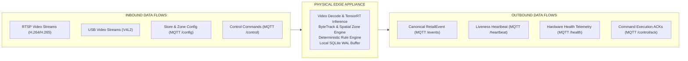

# docs/hardware/edge-input-output.md — Edge Input / Output Contract

> **THE PERIMETER DATA INTERFACE OF THE EDGE APPLIANCE**
> 
> This document specifies the boundary contracts governing all data that enters and exits the physical Retail Intelligencia edge computing appliance.

---

## 1. Perimeter Boundary Overview

---

## 2. Inbound Data Contract (What Enters the Edge)

The edge appliance accepts only two categories of inbound data: **Visual Optical Streams** and **Encrypted Configuration Messages**.

### 2.1 Optical Stream Ingestion
* **Format**: Interleaved H.264/H.265 video packets over RTSP/TCP, or raw frames via V4L2 USB drivers.
* **Payload Characteristics**:
  * Unauthenticated or local camera digest authentication.
  * In-memory decoding directly into GPU/NPU memory buffers.
  * Zero persistent storage of video frames on disk.
* **Stream Metadata**:
  * `cameraId`, `streamUrl`, `resolution`, `fps`, `codec`, `mountType`.

### 2.2 Configuration Ingestion
* **Format**: TLS-encrypted JSON messages delivered via MQTT topic `retail/{env}/{storeId}/{deviceId}/config`.
* **Payload Components**:
  * Store and appliance identifiers (`storeId`, `deviceId`).
  * Camera-to-Zone mapping tables.
  * Spatial zone coordinates (2D polygon vertices mapped to image coordinates).
  * Operational threshold parameters:
    * `queueThreshold`: Headcount limit before triggering `QUEUE_HIGH`.
    * `dwellThreshold`: Seconds before triggering `ZONE_DWELL`.
    * `shelfThreshold`: Fill percentage floor before triggering `SHELF_LOW_STOCK`.
  * Model inference rates and confidence cutoff values (e.g. `minConfidence: 0.60`).

> **CRITICAL INBOUND PRIVACY INVARIANT**
> 
> The edge appliance **never receives customer identity records, customer names, payment records, loyalty card data, or external facial recognition databases**. The edge processes visual geometry without knowing who any individual is.

---

## 3. Outbound Data Contract (What Leaves the Edge)

The edge appliance outputs exclusively structured operational intelligence and hardware diagnostic telemetry.

### 3.1 Primary Output: Canonical `RetailEvent`
* **Protocol & Topic**: MQTT `retail/{env}/{storeId}/{deviceId}/events` (QoS 1).
* **Format**: Standardized JSON conforming to [docs/contracts/retail-event-contract.md](file:///c:/hackathon/retail_intelligencia/docs/contracts/retail-event-contract.md).
* **Payload Content**: Synthesized retail conditions (`SHELF_LOW_STOCK`, `SHELF_EMPTY`, `QUEUE_HIGH`, `TRAFFIC_HIGH`, `TRAFFIC_LOW`, `ZONE_DWELL`).

### 3.2 Secondary Outputs: Heartbeat & Health Telemetry
* **Heartbeat**: Published every 30 seconds to `retail/{env}/{storeId}/{deviceId}/heartbeat` (QoS 0).
* **Health Telemetry**: Published every 60 seconds to `retail/{env}/{storeId}/{deviceId}/health` (QoS 1, Retain True).
  * Reports CPU, GPU, RAM, thermals, disk buffer utilization, camera frame stability, and inference latencies.

---

## 4. Strict Outbound Prohibitions

To ensure privacy compliance, bandwidth predictability, and architectural integrity:

1. **NO Continuous Video Streaming**: The edge appliance must **never stream continuous raw video, decoded video, or high-framerate image sequences to the cloud or dashboard**.
2. **NO Facial Biometrics**: The edge appliance must **never emit facial crop images, facial landmark vectors, or 512-d facial feature embeddings**.
3. **NO Customer Identity Records**: Outbound messages must never attempt to persist cross-visit customer identities or link shopper behavior to external identities.
