# docs/security/authentication-architecture.md — Authentication Architecture Specification

> **DUAL-TRACK IDENTITY & AUTHENTICATION SPECIFICATION**
> 
> This document specifies the authentication architecture for Retail Intelligencia, enforcing a strict structural separation between physical device credentials and human user identities.

---

## 1. Dual-Track Authentication Model

A major vulnerability in IoT platforms is treating physical computing appliances as "service accounts" sharing human user credentials. Retail Intelligencia completely bifurcates identity into two separate tracks:

```mermaid
flowchart TD
    subgraph DeviceTrack["DEVICE IDENTITY TRACK (Hardware Machines)"]
        EdgeHW["Physical Edge Appliance (deviceId)"]
        mTLS["mTLS X.509 Certificate / Pre-Shared Token"]
        DevScope["Cryptographically Bound to single storeId"]
        DevGateway["FastAPI Gateway / MQTT Broker Auth"]
    end

    subgraph HumanTrack["HUMAN USER TRACK (People)"]
        User["Store Manager / Floor Staff / Admin"]
        UserCreds["Email + Argon2 Password / SSO"]
        JWTToken["Short-Lived Signed JWT (15 min) + Refresh Cookie"]
        HumanScope["Role-Based & Store-Scoped Access"]
    end

    EdgeHW --> mTLS --> DevScope --> DevGateway
    User --> UserCreds --> JWTToken --> HumanScope
```



---

## 2. Device Identity & Credentials

### 2.1 Non-Human Principle
* An edge appliance is an unattended, physical computational machine.
* It must **never** be assigned a user account, email address, or human password.
* It must **never** share credentials with other edge appliances. Every physical node holds unique cryptographic material.

### 2.2 Device Identity Structure
* **`deviceId`**: Unique machine string (e.g. `edge_001`).
* **`storeId`**: The specific physical store to which the device is bound.
* **Authentication Method**:
  * **Primary (MQTT)**: Mutual TLS (mTLS) with client certificates signed by the Retail Intelligencia Device Intermediate CA. The certificate Common Name (CN) contains the `deviceId`, and the Subject Alternative Name (SAN) contains `URI:retail:store:{storeId}`.
  * **Fallback (HTTPS)**: 256-bit cryptographically random device API key (`devkey_...`) hashed with SHA-256 in the backend database.

### 2.3 Scope Enforcement
* An edge node holding credentials for `store_001` is cryptographically rejected if it attempts to publish to `retail/prod/store_002/*` or send events carrying `"storeId": "store_002"`.

---

## 3. Human User Identity & Credentials

### 3.1 User Authentication
* **Identifier**: Email address.
* **Password Storage**: Hashed using **Argon2id** (memory cost: 64 MB, iterations: 3, parallelism: 4).
* **Session Management**:
  * Access Token: Short-lived JSON Web Token (JWT), 15-minute expiration, signed via asymmetric RS256 / EdDSA.
  * Refresh Token: Secure, HttpOnly, SameSite=Strict cookie stored with rotation.

### 3.2 Human Token Payload
```json
{
  "sub": "usr_01J98X7Z8K3M0W4V8R9N1P2Q3R",
  "email": "manager.marcus@superstore.com",
  "role": "STORE_MANAGER",
  "storeId": "store_001",
  "iat": 1788604200,
  "exp": 1788605100,
  "iss": "https://auth.retail-intelligencia.io"
}
```

---

## 4. Key Security Invariants

1. **No Shared Hardware Secrets**: Never use a single hardcoded API key or root certificate across multiple edge boxes. Compromising one edge box must never compromise another store.
2. **Revocation Capability**: The backend maintains a Certificate Revocation List (CRL) and token revocation cache (Redis / in-memory). Compromised devices are severed within seconds.
3. **No Credential Storage on Cameras**: Cameras communicate only within the isolated store VLAN; external cloud credentials never reside on camera hardware.
