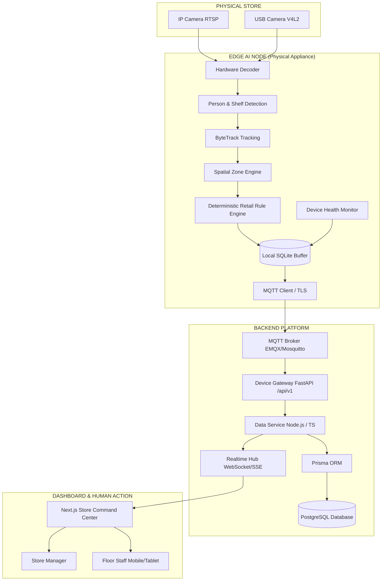

# memory.md — Persistent Architectural Constitution

> **SINGLE SOURCE OF TRUTH FOR RETAIL INTELLIGENCIA**
> 
> This document is the persistent memory and operating constitution for all engineers and autonomous AI agents working on Retail Intelligencia. Any implementation decision must adhere to this document.

---

## 1. Project Identity

* **Project Name**: Retail Intelligencia
* **System Classification**: Hardware-First Edge AI Retail Intelligence Platform
* **Target Environment**: Physical Supermarkets, Grocery Stores, and Retail Box Stores
* **Core Value Proposition**: Real-time conversion of physical in-store camera streams into structured, actionable operational events (`RetailEvent`) processed locally on edge hardware, enabling managers and staff to instantly remediate stockouts, queue congestion, and operational bottlenecks without streaming raw customer video to the cloud.

---

## 2. Absolute Product Principle

Retail Intelligencia is an edge-first, hardware-centric platform. The physical edge computing appliance deployed inside the retail store is the core operational product. The software cloud/server stack exists to configure hardware, ingest validated telemetry, persist operational history, trigger business workflows, and present actionable realtime interfaces to retail staff.

```text
SENSE          UNDERSTAND          DECIDE          ACT
───────        ──────────          ──────          ───
Cameras   ──►  Edge Vision   ──►   Retail    ──►   Staff Task
Sensors        & Tracking          Rules           Resolution
```

**Never treat Retail Intelligencia as a generic SaaS dashboard with mock AI.**

---

## 3. Scope Boundary

### In-Scope for MVP
1. **Camera Ingestion**: IP cameras via RTSP and local USB video streams.
2. **Local Edge Inference**:
   * Person detection and spatial bounding box estimation.
   * Ephemeral multi-object tracking (`track_id`) via ByteTrack/SORT (no cross-camera re-ID).
   * Product / shelf vacancy estimation (occupancy percentage heuristics).
3. **Retail Rule Engine**:
   * Shelf low-stock & shelf out-of-stock detection.
   * Checkout queue count & estimated wait time thresholding.
   * Traffic intensity (high/low shopper count per zone).
   * Zone dwell duration monitoring.
4. **Standardized Event Contract**: Generation of canonical, validated `RetailEvent` envelopes.
5. **Local Event Buffering**: SQLite/WAL disk buffer on edge hardware ensuring zero data loss during network outages.
6. **Secure Telemetry Transport**: MQTT over TLS with granular topic taxonomy and QoS delivery.
7. **Device Health & Heartbeat**: Real-time reporting of edge CPU, GPU, RAM, thermal metrics, and camera status.
8. **Backend API Gateway & Data Service**:
   * Device Gateway in Python/FastAPI (`/api/v1`).
   * Data Service in Node.js / TypeScript using Prisma ORM.
   * Normalized PostgreSQL persistence.
9. **Realtime Broadcast**: Low-latency event streaming to client dashboards via WebSockets / Server-Sent Events (SSE).
10. **Store Operations Dashboard**: Next.js web application for Store Managers and Floor Staff with real-time zone map, live alerts, and task dispatching.

### Out-of-Scope for MVP (Strictly Excluded)
* ❌ Facial recognition, facial landmarking, demographic classification (age/gender/ethnicity).
* ❌ Persistent cross-camera customer identity re-identification.
* ❌ Streaming raw or decoded 24/7 video to the cloud.
* ❌ Automated Point of Sale (POS) checkout integration / cashless checkout.
* ❌ Generative LLMs for core real-time frame-by-frame computer vision or event emission.
* ❌ Direct Prisma access from Python/FastAPI.
* ❌ Multi-tenant cross-store federated learning.

---

## 4. Canonical System Architecture



---

## 5. Hardware / Software Boundary Matrix

| Functional Area | Edge Node (Hardware/Edge SW) | Backend Service (Cloud/Server) | Dashboard (Next.js) |
| :--- | :--- | :--- | :--- |
| **Video Capture & Decoding** | **100% Owned** (RTSP, V4L2, H.264/H.265) | 0% (Never receives raw video) | 0% |
| **Model Inference** | **100% Owned** (TensorRT / ONNX Runtime) | 0% (No cloud vision models) | 0% |
| **Object Tracking** | **100% Owned** (Frame-to-frame association) | 0% | 0% |
| **Zone Evaluation** | **100% Owned** (Polygon inclusion tests) | 0% | Read-only visual overlay |
| **Event Generation** | **100% Owned** (`RetailEvent` synthesis) | 0% (Ingests and validates) | 0% (Consumes) |
| **Local Offline Buffer** | **100% Owned** (SQLite disk cache) | 0% | 0% |
| **Device Provisioning** | Requests registration with certs | **100% Owned** (Approves and assigns) | Admin interface trigger |
| **Event Persistence** | Temporary queue only | **100% Owned** (PostgreSQL) | Query cache |
| **Task / Alert Creation** | 0% | **100% Owned** (Business rule logic) | Action UI |
| **Realtime Distribution**| 0% (Publishes MQTT) | **100% Owned** (WebSocket / SSE) | Subscribes & renders |
| **Human Staff Actions** | 0% | Validates & logs audit trail | **100% Owned** (Interactive UX) |

---

## 6. Common Retail Event Contract

Every event leaving edge devices MUST strictly conform to this JSON schema:

```json
{
  "eventId": "evt_01J...",
  "eventVersion": "1.0",
  "eventType": "SHELF_LOW_STOCK",
  "deviceId": "edge_001",
  "storeId": "store_001",
  "zoneId": "zone_aisle_04",
  "timestamp": "2026-09-05T10:30:00Z",
  "confidence": 0.94,
  "severity": "HIGH",
  "metadata": {
    "shelfId": "shelf_04_b",
    "productCategory": "Beverages",
    "occupancyPercentage": 15.0,
    "threshold": 25.0
  },
  "source": {
    "cameraId": "cam_04",
    "modelId": "shelf-detector",
    "modelVersion": "1.0.0"
  },
  "schemaVersion": "1.0"
}
```

### Required Fields & Constraints
1. `eventId`: Globally unique string (e.g. ULID / UUIDv7 prefixed with `evt_`).
2. `eventVersion`: Version of the event definition (current: `"1.0"`).
3. `eventType`: Enum from the approved MVP event list.
4. `deviceId`: Unique ID of the physical edge appliance.
5. `storeId`: Unique ID of the retail establishment.
6. `zoneId`: Unique identifier for the configured spatial zone.
7. `timestamp`: ISO-8601 UTC timestamp string (`YYYY-MM-DDTHH:mm:ssZ`).
8. `confidence`: Float between `0.0` and `1.0`.
9. `severity`: Enum: `"INFO"`, `"LOW"`, `"MEDIUM"`, `"HIGH"`, `"CRITICAL"`.
10. `metadata`: Validated JSON object specific to `eventType`.
11. `source`: Provenance object containing `cameraId`, `modelId`, and `modelVersion`.
12. `schemaVersion`: Version of the envelope schema (current: `"1.0"`).

---

## 7. Approved MVP Event Types

1. **`SHELF_LOW_STOCK`**: Shelf product fill percentage dropped below configured low threshold (e.g. < 25%).
2. **`SHELF_EMPTY`**: Complete vacancy detected in a monitored shelf compartment (fill = 0%).
3. **`QUEUE_HIGH`**: Number of patrons detected in a checkout queue polygon exceeds queue depth limit.
4. **`TRAFFIC_HIGH`**: Instantaneous or windowed foot traffic in a zone exceeds normal capacity limit.
5. **`TRAFFIC_LOW`**: Foot traffic falls significantly below expected operating bounds during store hours.
6. **`ZONE_DWELL`**: A tracked entity's dwell time inside an active zone exceeds the operational alert threshold (e.g. assistance needed or bottleneck).
7. **`DEVICE_HEALTH`**: Heartbeat and telemetry packet reporting CPU, GPU, memory, thermal, and camera stream status.

---

## 8. MQTT Topic Namespace & Protocol

Topic Root Pattern:
```text
retail/{environment}/{storeId}/{deviceId}/...
```

* **Edge → Platform**:
  * Telemetry Events: `retail/{env}/{storeId}/{deviceId}/events` (QoS 1, No Retain)
  * Heartbeat: `retail/{env}/{storeId}/{deviceId}/heartbeat` (QoS 0, No Retain)
  * Health / Metrics: `retail/{env}/{storeId}/{deviceId}/health` (QoS 1, Retain True)
* **Platform → Edge**:
  * Configuration Push: `retail/{env}/{storeId}/{deviceId}/config` (QoS 1, Retain True)
  * Edge Control Commands: `retail/{env}/{storeId}/{deviceId}/control` (QoS 2, No Retain)

*Transport Security*: All MQTT connections must use TLS 1.3 with individual per-device client certificate authentication (mTLS) or pre-shared device tokens.

---

## 9. API Boundary & Endpoints (`/api/v1`)

* **Devices**:
  * `POST /api/v1/devices/register` — Initial device enrollment.
  * `GET  /api/v1/devices/{deviceId}` — Device status and configuration.
  * `GET  /api/v1/devices/{deviceId}/health` — Latest hardware health telemetry.
  * `POST /api/v1/devices/{deviceId}/heartbeat` — HTTP fallback heartbeat.
* **Events**:
  * `POST /api/v1/events` — Ingest single or batched `RetailEvent` (HTTP fallback).
  * `GET  /api/v1/events` — Query historical events with filters (store, zone, severity, type).
  * `GET  /api/v1/events/{eventId}` — Detailed event payload.
* **Stores & Zones**:
  * `GET  /api/v1/stores` — List authorized stores.
  * `GET  /api/v1/stores/{storeId}` — Store metadata and layout.
  * `GET  /api/v1/stores/{storeId}/zones` — Configured spatial polygons and thresholds.
* **Alerts & Tasks**:
  * `GET  /api/v1/alerts` — Active operational alerts.
  * `POST /api/v1/alerts/{alertId}/acknowledge` — Mark alert as acknowledged by staff.
  * `GET  /api/v1/tasks` — List staff operational tasks.
  * `POST /api/v1/tasks/{taskId}/assign` — Assign task to staff user.
  * `POST /api/v1/tasks/{taskId}/complete` — Mark task resolved with notes.

---

## 10. Database Architecture & Entities

### Persistence Stack
* **FastAPI Gateway**: Device-facing gateway, validates events and handles ingestion.
* **Node.js / TypeScript Data Service**: Core business domain, workflows, Prisma ORM.
* **PostgreSQL**: Relational database with B-tree and BRIN time-series indexes.

> **CRITICAL RULE**: Never use Prisma directly from Python. Python services communicate with the data layer via internal API contracts or direct SQL migrations managed strictly in TypeScript.

### Primary Entities
1. `Store`: Physical store location, operational hours, time zone.
2. `Device`: Physical edge computer metadata, MAC address, certificate thumbprint, online status.
3. `Camera`: Sensor entity associated with a Device, RTSP URL, resolution, framerate.
4. `Zone`: Spatial polygon within a camera view, mapped to a retail aisle, shelf, or checkout.
5. `Event`: Persisted record of canonical `RetailEvent` envelopes.
6. `Alert`: De-duplicated operational problem requiring visibility.
7. `Task`: Actionable work item assigned to store personnel with lifecycle (`DETECTED` → `ASSIGNED` → `IN_PROGRESS` → `COMPLETED`).
8. `User`: Human accounts with roles (`PLATFORM_ADMIN`, `STORE_MANAGER`, `STORE_STAFF`).

---

## 11. Authentication & Authorization

* **Human Identities**:
  * Authenticated via JWT (JSON Web Tokens) or secure session cookies.
  * Scoped to specific `storeId` values (except `PLATFORM_ADMIN`).
  * Roles:
    * `PLATFORM_ADMIN`: Fleet-wide access, device provisioning, global config.
    * `STORE_MANAGER`: Single-store visibility, alert triage, task assignment, analytics, zone adjustments.
    * `STORE_STAFF`: Single-store visibility, view assigned tasks, acknowledge alerts, mark completion.
* **Device Identities**:
  * Authenticated via unique device credentials (mTLS x509 certificates or high-entropy device API keys).
  * Tied strictly to a single `storeId` and `deviceId`. A device can never emit events or read config for another store.
  * Completely separated from human identity tables.

---

## 12. Modular AI Architecture

The edge computer vision system must be decoupled into independent pipeline stages:

1. **Stream Capture & Decoupling**: Hardware-accelerated H.264/H.265 decoding via FFmpeg / GStreamer into shared memory ring buffers.
2. **Person Detection Module**: Lightweight CNN/YOLO model optimized via TensorRT/ONNX. Detects `person` bounding boxes with confidence scores.
3. **Product / Shelf Occupancy Module**: Specialized detector estimating shelf surface bounding boxes and percentage fill.
4. **Multi-Object Tracking (MOT)**: ByteTrack or SORT association layer maintaining intra-camera frame-to-frame `track_id` coordinates. Tracks are ephemeral and wiped upon zone departure.
5. **Spatial Zone Projector**: Evaluates point-in-polygon math mapping tracked foot positions to calibrated store floor zones.
6. **Deterministic Retail Rule Engine**: Evaluates time windows, queue lengths, and shelf fill percentages against configurable thresholds to emit `RetailEvent` envelopes.

---

## 13. Privacy Constraints

1. **Zero Biometrics**: No facial recognition, face matching, or facial embedding generation.
2. **Zero Customer PII**: The system does not collect names, credit cards, or customer identities.
3. **Ephemeral Tracking**: `track_id` integers exist only in edge RAM during tracking and are never exported to the backend as persistent customer identifiers.
4. **Local Video Boundary**: Video streams NEVER leave the physical store network under normal operations. Only metadata JSON packets leave the edge.

---

## 14. Failure & Recovery Architecture

* **Camera Disconnection**: Edge node marks camera status as `DISCONNECTED` in health telemetry. Inference pipeline suspends for that channel. **Zero synthetic or hallucinated events are emitted.**
* **Model Crash**: Process supervisor (systemd / container restart) isolates the failure and emits a `DEVICE_HEALTH` warning. Detections halt safely until restart.
* **Network Partition**: Edge continues full local inference and retail event generation. All events are written to the local SQLite buffer.
* **Network Restored**: Buffer replay engine drains the local queue over MQTT with rate-limiting and timestamp preservation.
* **Backend Idempotency**: Backend deduplicates inbound events using `eventId`. Duplicate deliveries produce no duplicate alerts or tasks.

---

## 15. Development Phases

- [x] **Phase 0**: System Definition & Architecture
- [x] **Phase 1**: Repository & Development Infrastructure
- [x] **Phase 2**: Edge Device Foundation (Simulated via scripts for now)
- [x] **Phase 3**: Computer Vision Runtime (Architecture & Scripts)
- [x] **Phase 4**: Retail Intelligence Engine (Event schemas)
- [x] **Phase 5**: Backend & Data Platform (Prisma, PostgreSQL, FastAPI Gateway)
- [x] **Phase 6**: Realtime Dashboard (Next.js, SSE, Live Map)
- [x] **Phase 7**: Staff Action System (Alert to Task lifecycle)
- [ ] **Phase 8**: Analytics, Testing & Optimization
- [ ] **Phase 9**: Deployment & Presentation

*Current Phase:* **Phase 8: Analytics, Testing & Optimization**

### Recent Milestones
*   **[2026-09-05] Phase 6 & 7 & Portfolio Complete**: Implemented the `services/web` Next.js Dashboard and `services/portfolio` showcase site. Dashboard uses SSE via FastAPI for real-time reactivity, TanStack Query for cache management, and a custom Tailwind v4 Dark Editorial design system. Portfolio built as a static-ready separate Next.js app with deep architectural case studies.

---

## 16. Mandatory Rules for Agents

1. **Read `memory.md` before touching any code or docs.**
2. **Read relevant subsystem documentation in `docs/` before implementing any component.**
3. **Never silently alter or expand system architecture.**
4. **Never silently expand the MVP scope.**
5. **Never invent or modify the `RetailEvent` schema without formal increment.**
6. **Preserve the hardware/software boundary at all costs.**
7. **Never execute or import Prisma from Python code.**
8. **Never allow raw video to be streamed to the cloud or dashboard.**
9. **Never hardcode secrets, credentials, or private keys.**
10. **Never implement facial recognition or persistent customer re-identification.**
11. **Never use generative LLMs for deterministic frame-by-frame detection or queue counting.**
12. **Always enforce privacy-by-design principles.**
13. **Always design edge components to withstand complete network disconnection.**
14. **Ensure all backend event ingestion paths are strictly idempotent.**
15. **Verify that test suites pass before claiming any phase or task is complete.**
16. **Synchronize all changes in `docs/` and `memory.md` when approved modifications occur.**
17. **Never fabricate AI detections or mock data to hide edge failures.**
18. **Prefer lightweight, production-grade dependencies over complex bloatware.**
19. **Keep system components strictly typed and documented.**
20. **Optimize every component for a physical, hardware-first real-time retail deployment.**
